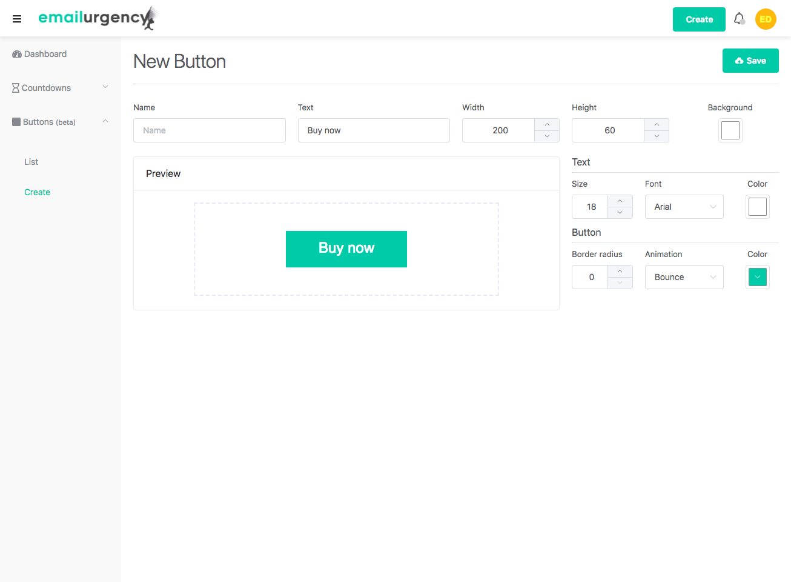
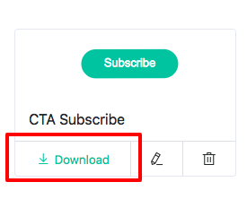

# Animated Buttons

Animated buttons are special gif images extracted from a customizable button. As an Emailurgency user you can create unlimited buttons within your dashboard.

### Create a button

Within your dashboard, click on _Buttons -> Create_ to get access to the button designer.

Choose a name for your reference ans set the characteristics of the button you want to edit such as size, colors, border radius and animation.
Click _Save_ when you're done.

### Download an animated button

Go to the buttons list clicking on _Buttons -> List_ and click on the _Download_ button above the desired animated button.

### Animated button usage

Once you downloaded the your button, simply embed it in your next email like every other image, and happy converting!