# Create

[Login to the dashboard](https://app.emailurgency.com/login) and click on create _Countdowns->Create_.

If you're on a paid plan you can chose between fixed date and dynamic date countdowns.

#### Fixed Date

When a countdown has a fixed date, you are required to choose an ending date and time. The countdown will count to the same ending date in every email.

#### Dynamic Date

With dynamic date, you choose a duration instead. The countdown will count to a date automatically calculated based on the sending date and time.

This solution is perfect for all cases where you need to send a different countdown for each email or group of emails (e.g. drip campaigns).

## Editor

Once you select the kind of countdown you need, you can **start designing your awesome countdown**.

### Name

You can give a name to each countdown for your future reference.

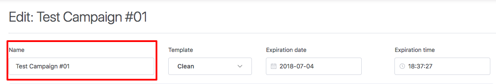

### Template

Choose a template to change the countdown style of elements.

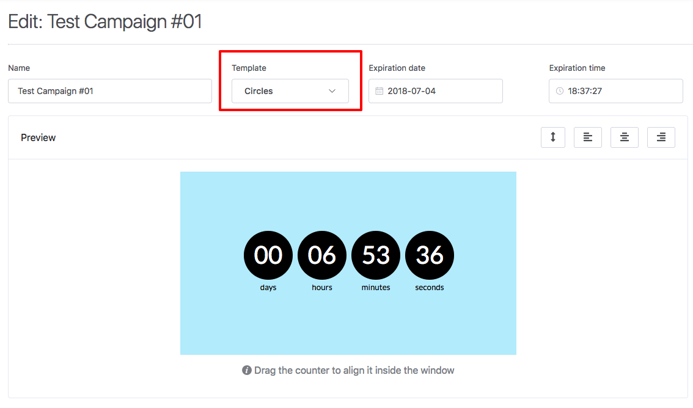

### Expiration

If you chosen a **fixed date** countdown, you'll set an expiration date and time.

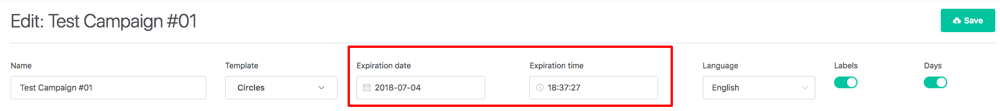

If you chosen a **dynamic date** instead, you'll set a timespan in minutes, hours or days.

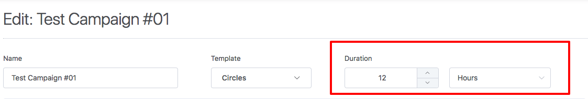

### Language

Select the language you want to display under countdown elements.

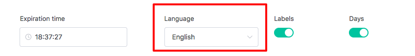

### Labels

You can hide the countdown label.

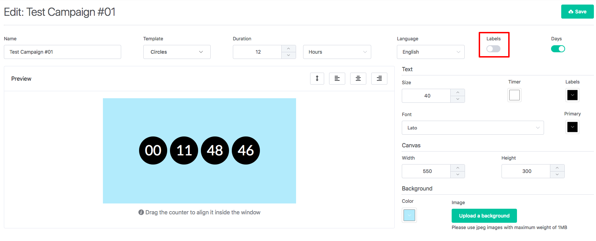

### Days

If your countdown expires in less than a day you might want to hide the days counter.

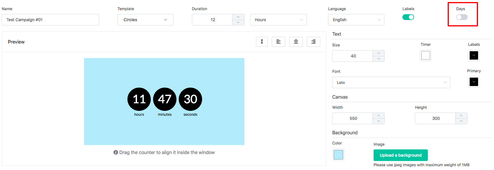

### Text

#### Size

Set a different size for elements (in pixel).

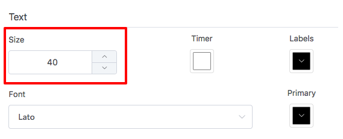

#### Timer Color

This color will be applied to numbers.

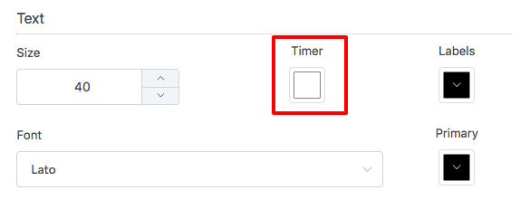

#### Labels Color

This color will be applied to labels (days, hours, minutes, seconds).

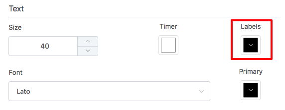

#### Primary Color

If the template you chosen has shapes, primary color will change thos shapes' color.

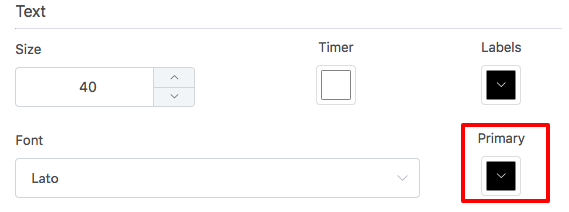

#### Font

Emailurgency provides different font styles that will be applied both to numbers and labels.

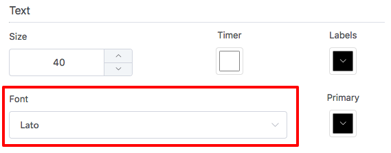

### Canvas

#### Width and Height

Changes the size of the entire image.

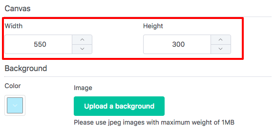

#### Background Color

This is the plain overall background color.

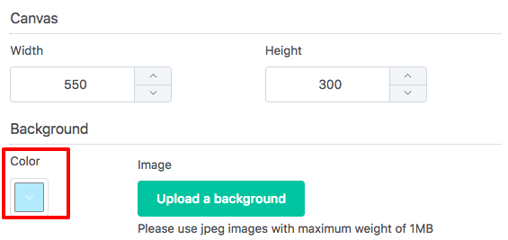

#### Background Image

You can upload an image to be used as background. We accept jpeg files up to 1mb in size.

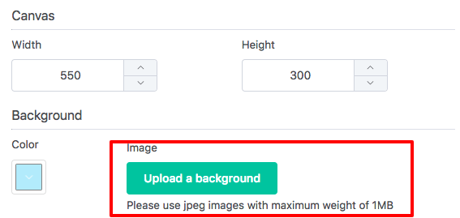

### Preview

The preview area shows you the result in real time. You can drag the timer to change its position in relation to the image.

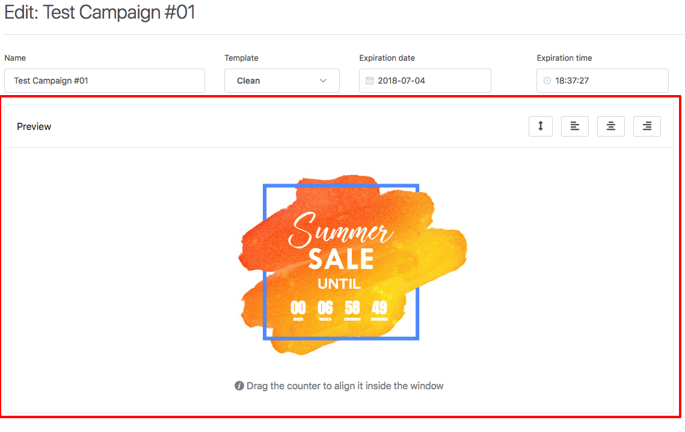