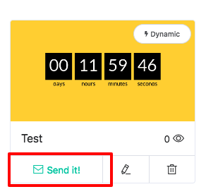
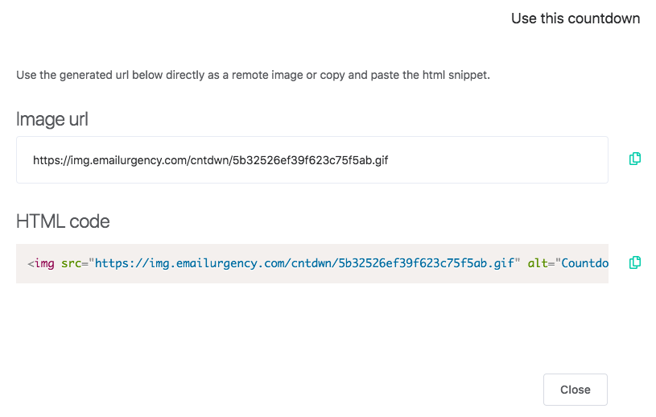
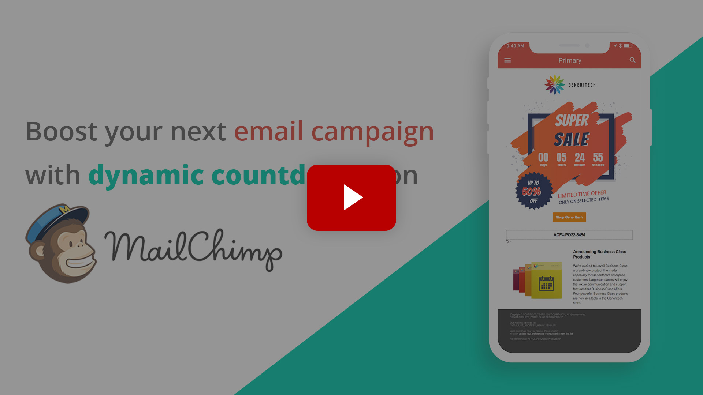

# Countdown Usage

To use a countdown you just have to embed it as an image into your next email or landing page.

::: warning Heads up!
The image should have the exact src url provided. If you embed the image as attachment or re-upload the image somewhere else the countdown won't work.
:::

### Get the code

When inside the List section of your dashboard, click on **_Send it!_**.

### Copy and Paste

Either copy the image url or the html snippet and past it within your email.

## Example Usage on MailChimp

